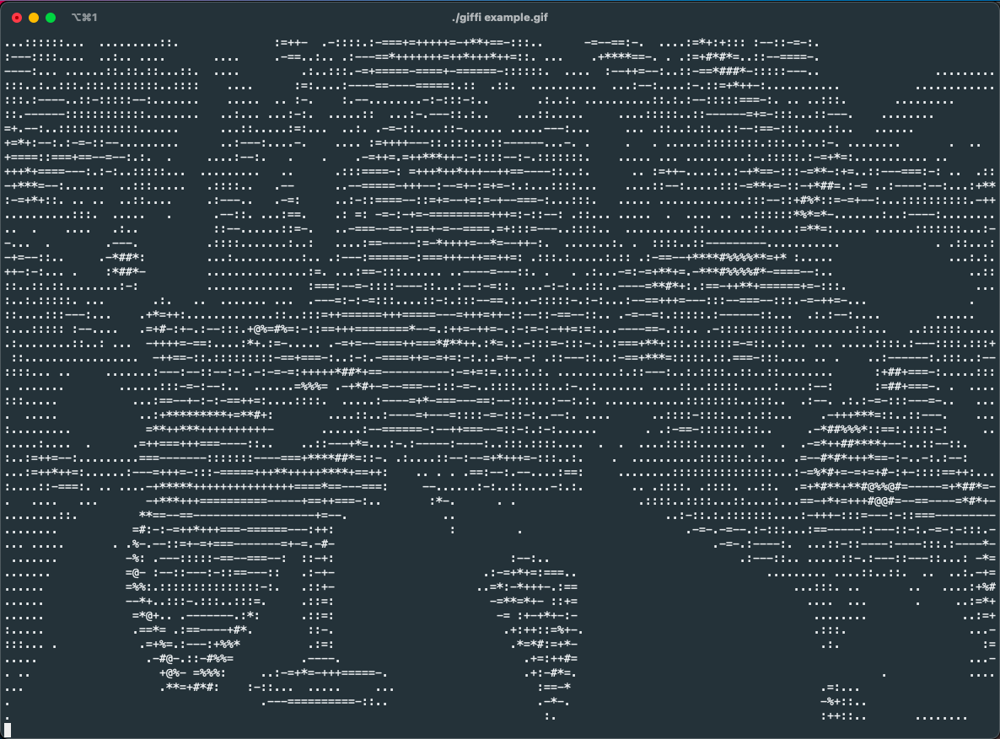

# giffi

Because you really do need to view animated GIFs in ASCII form inside your terminal.

## Screenshot



## Usage

```
# Build it
go build cmd/giffi.go

# View a local .gif file
./giffi some/path/image.gif

# View a remote .gif file
./giffi https://example.com/image.gif
```
